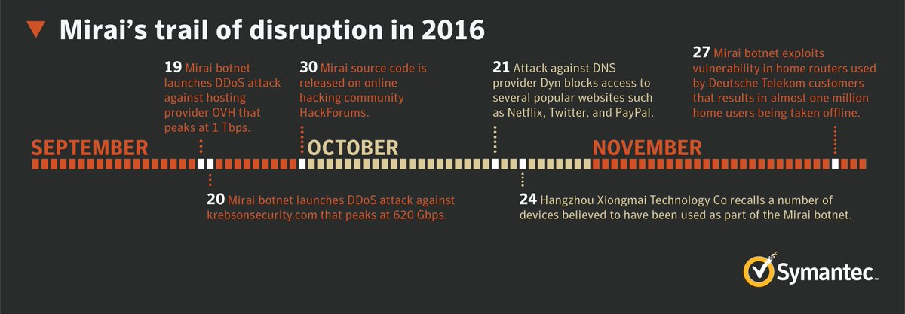
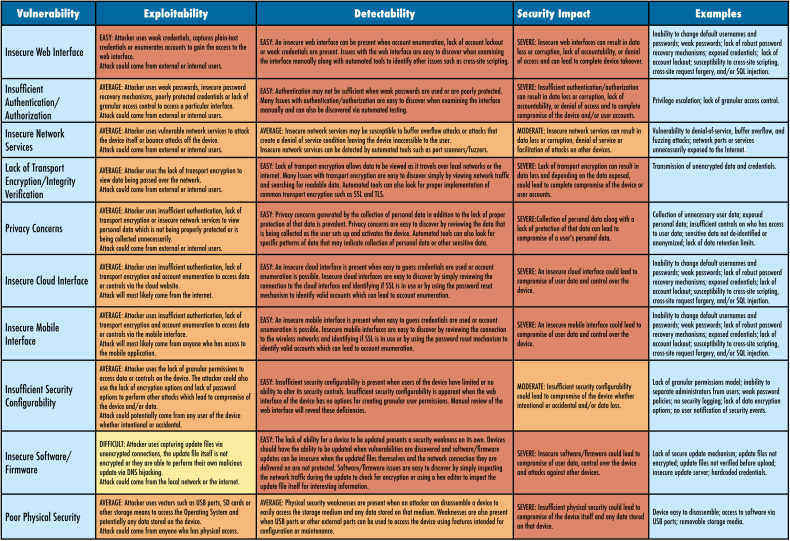

# Mirai Botnet - Analysis and Simulation

### Introduction

IoT devices are an ever-growing category of network devices, including printers, routers, security cameras, smart TVs, etc. Those devices have particularly susceptible to malware attacks and are becoming increasingly attractive targets for cybercriminals because of lack of security.

Recently, IoT devices have been used to create **large-scale botnets**, which can deliver highly destructive Distributed Denial of Service (DDoS) attacks. One of these malwares, **Mirai**, brought to light the problem of IoT Security, and an increased attention to the topic of interconnected devices.

In Tuesday, September 20th 2016, KrebsOnSecurity.com blog was targeted by an extremely large and unusual Distributed Denial-of-Service attack (DDoS) of over **660 Gbps of traffic**. The attack seems to have been designed to knock offline the website of the investigative cybercrime journalist Brian Krebs in retaliation for the arrest of the owners of vDOS attack-for-hire service. The attack did not succeed, but according to Akamai it was nearly **double the size of the largest attack they had ever seen** and it orders of magnitude more traffic than is typically needed to knock the most of sites offline.

In the same month, an attack sharing the same technical characteristics was launched against the **French webhost OVH**, breaking the record for the largest recorded DDoS attack with at least **1.1 Tbps of traffic**. Multiple attacks have been registered since then, especially after the code for the malware has been release on September 30th 2016.

The most interesting aspect of this attack is that it was not performed by using traditional reflection/amplification DDoS, but with **direct traffic** instead: the attack was carried out by a **Botnet** (or Zombie Network) of hacked devices. While the total number of devices involved was not known for sure, it was sure that hundreds of thousands of compromised devices were related to the Internet of Things (mainly home routers, IP security cameras, Digital Video Recorder boxes and printers). The IoT devices became infected with malware by very **simple Telnet dictionary attacks** and were made part of the botnet that would then deliver the DDoS attack.

### IoT Security Problem

The more connected devices, the bigger the threat. Typically IoT devices are poorly secured (sometimes, not secured at all) and the interconnected nature of these smart objects means that every poorly secured device that is connected online, it potentially affects the security and resilience of the network.

The main problem with IoT devices is that the majority of them has lack of even elementary security and they present some interesting features which make them an ideal target for hackers. To name a few, those devices:

- are highly scalable
- are always online
- are connected to fast Internet networks
- are highly heterogeneous
- might connect to Internet other offline objects
- can be phisically unprotected
- might not require particular permissions (such as root access or user interaction)

The IoT Security problem has been analyzed also by the Open Web Application Security Project and they identified the [**10 most common IoT vulnerabilities**](https://www.owasp.org/images/b/b0/OWASP_Top_10_2017_RC2_Final.pdf) which are shown in the following table:

### Botnets and DDoS

<!--
Insert here some state-of-the-art on botnets and DDoS
- What is DoS attack and its types
- What is a botnet
- Botnet for DoS : birth of DDoS
-->

### Mirai : malware analysis

<!--
Analysis on the malware part of Mirai
- Analysis of telnet access
- Analysis of hardcoded passwords
- Analysis of scanning for other infectable devices (and avoidance of some hardcoded IPs)
- Analysis of how it detected other malwares
-->

### Mirai : DDoS

<!--
Analysis on the DDoS part of Mirai
- how it gets integrated in the botnet
- how it actually communicated with the "hive mind" to start the attack
-->

### A Mirai simulation

<!-- Attack simulation -->
